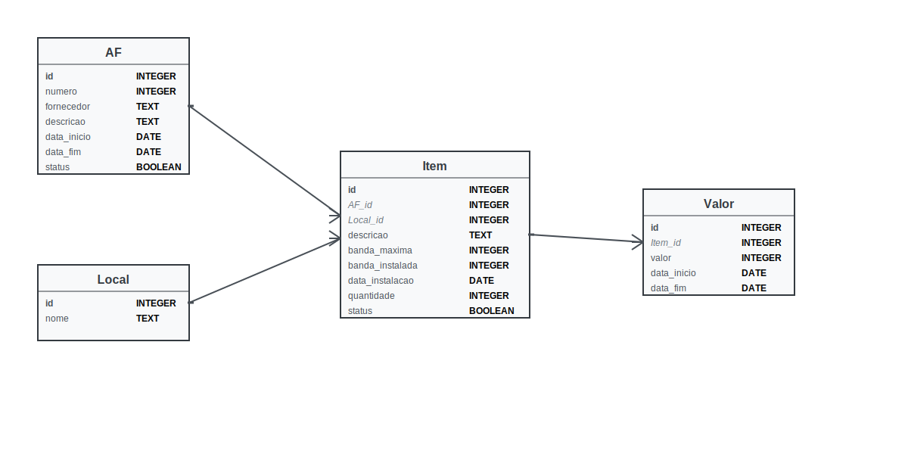

# Sistema de Gestão de Autorizações de Fornecimento

## ER model


## Setup
```
for f in schema/*; do
	sqlite3 test.db < f
done
sqlite-history test.db AF Item Local Valor
sqlc-1.25 generate
go build -ldflags=-s
```
